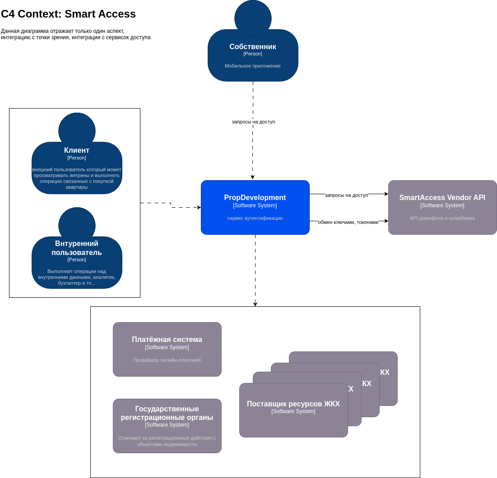
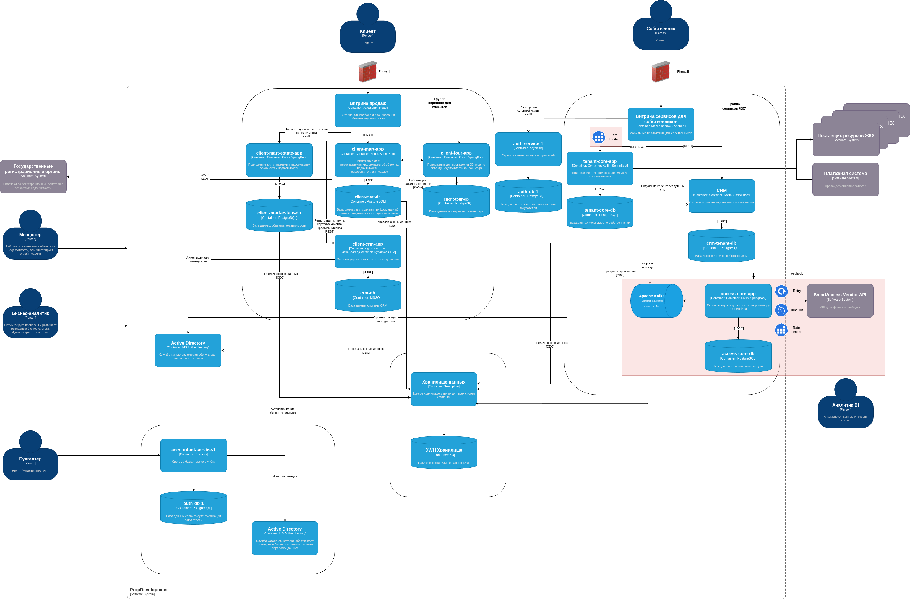

# Требования к безопасности внешней интеграции с Партнерским апи API

## 1. Требования к безопасности
- **Шифрование данных**:  
  Все передаваемые данные (биометрия, номера автомобилей, команды управления) должны шифроваться **TLS 1.2+** (HTTPS). *Причина:* предотвращение перехвата PII-данных.  
- **Защита PII**:  
  Биометрические данные и номера машин должны храниться у вендора **только в анонимизированном/хэшированном виде**. *Причина:* соответствие GDPR/ФЗ-152.  
- **Ограничение доступа API**:  
  Доступ к API только с предварительно одобренных IP-адресов PropDevelopment. *Причина:* минимизация риска DDoS/несанкционированных запросов.  

## 2. Протоколы аутентификации и авторизации
- **OAuth 2.0** (с grant type `client_credentials`):  
  Для сервис-сервисной аутентификации. *Причина:* безопасное управление доступом без участия пользователя.  
- **JWT с коротким TTL (≤5 мин)**:  
  Для авторизации запросов между системами. *Причина:* снижение риска компрометации долгоживущих токенов.  
- **API-ключи**:  
  Использовать **HMAC-SHA256** для подписи запросов. *Причина:* защита от подмены данных в transit. Ключи должны храниться в vault (например, HashiCorp Vault).  

## 3. Организация взаимодействия систем
- **Схема обмена**:  
  Асинхронное взаимодействие через **Webhooks** (для событий) + REST API (для команд).  
- **Ретрансляция команд**:  
  Все команды на открытие двери/шлагбаума должны подтверждаться **двухфакторно** (например, JWT + подпись HMAC).  
- **Мониторинг**:  
  Логирование всех запросов с обязательными полями: `timestamp`, `source IP`, `тип операции`, `статус`. Логи хранить 90+ дней.  
  - доступ к аудит логам в том числе на стороне вендора.

**Критичное требование к API-ключам**:  
- Ключи должны **ротироваться** каждые 30 дней и никогда не хардкодиться в приложении. *Аргумент:* компрометация ключа → полный контроль над умной инфраструктурой.  

